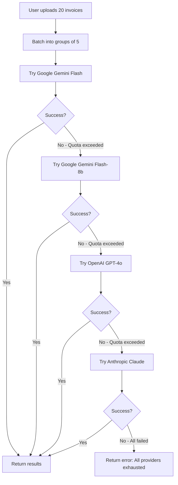

# Invoice Extractor API - Quota Optimization Guide

## API Usage Patterns

### Current Implementation: Batch Processing

**Before Optimization:**
- 20 bulk invoices = 20 separate API calls
- Google free tier: 50 requests/day
- Exhaustion: After 2.5 bulk uploads (50 ÷ 20 = 2.5)

**After Optimization (Batch Processing):**
- 20 invoices = 4 API calls (5 images per call)
- Google free tier: 50 requests/day  
- Now handles: 12.5 bulk uploads (50 ÷ 4 = 12.5)

## How Batch Processing Works

### Single Request (1 invoice):
```
POST /extract-details/
→ 1 API call to Gemini
→ 1 quota unit used
```

### Bulk Request (20 invoices):
```
POST /bulk-extract/
→ Processes in batches of 5 images per API call
→ 20 invoices = 4 API calls (20 ÷ 5 = 4)
→ 4 quota units used (instead of 20)
```

## Quota Efficiency Comparison

| Scenario | Old Method | New Batch Method | Savings |
|----------|------------|------------------|---------|
| 5 invoices | 5 API calls | 1 API call | 80% savings |
| 10 invoices | 10 API calls | 2 API calls | 80% savings |
| 20 invoices | 20 API calls | 4 API calls | 80% savings |

## Free Tier Limits (Google Gemini)

| Provider | Free Tier Limit | Cost per 1K requests (Paid) |
|----------|----------------|----------------------------|
| Google Gemini Flash | 50 requests/day | $0.075 |
| OpenAI GPT-4o | 3 requests/day | $5.00 |
| Anthropic Claude | 5 requests/day | $3.00 |

## Production Recommendations

### 1. **Multi-Provider Setup** (Already Implemented)
```bash
# Primary (Highest quota/lowest cost)
GOOGLE_API_KEY=your_google_key

# Fallbacks (Automatic when primary exhausted)
OPENAI_API_KEY=your_openai_key
ANTHROPIC_API_KEY=your_anthropic_key
```

### 2. **Optimize Batch Size**
```bash
# Balance between efficiency and API limits
BATCH_SIZE=5  # 5 images per API call (recommended)
```

### 3. **Monitor Usage**
- Use `/health` endpoint to check provider status
- Use `/providers` endpoint to see quota usage
- Use `/reset-providers` to reset failed providers

## Cost Analysis for Production

### Scenario: 1000 invoices/day

**With Batch Processing:**
- API calls needed: 1000 ÷ 5 = 200 calls/day
- Google paid tier: 200 × $0.075/1000 = $0.015/day
- Monthly cost: ~$0.45/month

**Without Batch Processing:**
- API calls needed: 1000 calls/day  
- Google paid tier: 1000 × $0.075/1000 = $0.075/day
- Monthly cost: ~$2.25/month

**Savings: 80% reduction in API costs**

## Fallback Strategy



## API Limits Summary

| Free Tier Capacity | Invoices per Day |
|--------------------|------------------|
| Google only | 250 invoices (50 calls × 5 per call) |
| Google + OpenAI | 265 invoices (50 + 3 × 5) |
| Google + OpenAI + Anthropic | 290 invoices (50 + 3 + 5 × 5) |

## Monitoring & Alerts

The API includes endpoints to monitor quota usage:

```bash
# Check overall health
GET /health

# Check all provider status
GET /providers  

# Reset failed providers (admin)
POST /reset-providers
```

## Best Practices

1. **Enable all fallback providers** for maximum reliability
2. **Use batch processing** for bulk operations
3. **Monitor provider status** regularly
4. **Consider paid tiers** for production workloads
5. **Implement retry logic** in your client applications
